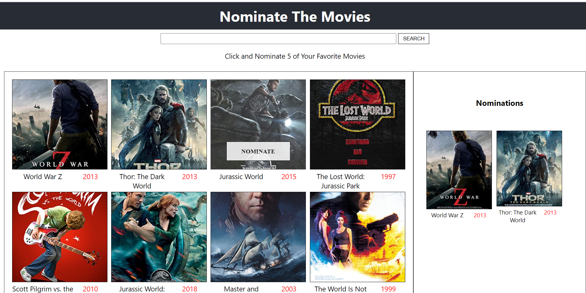
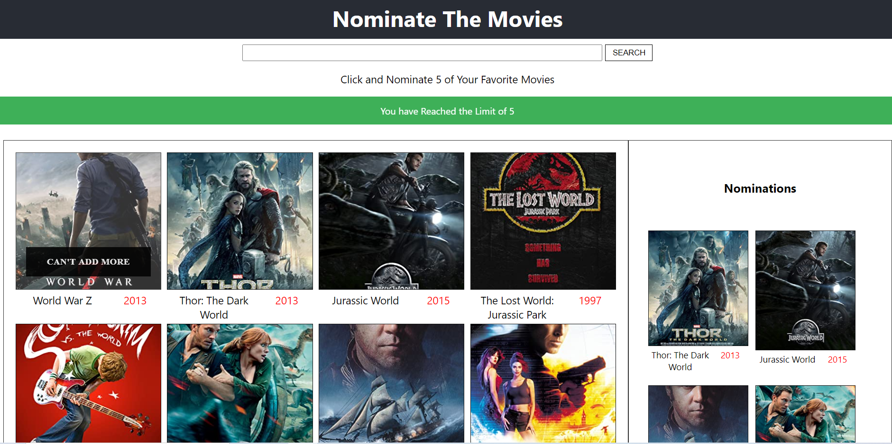

</p>



<h2 align="center"><a  href="https://omdb-awards.herokuapp.com/">Live Demo</a></h2>

<!-- ### [Contributions are Welcome](https://github.com/silent-lad/VueSolitaire/blob/master/CONTRIBUTING.md) -->

## Description

OMDB AWARDS is a web app implamented with react where user can Nominate till 5 movies.Here,Through OMDB API,Movies are fetched and displayed

## How to use

- **Search** Search your favourite movie through search bar.
- **Nominate** Click the hover button and Nominate the movies and user have the limit of 5.when user add the movie to nomination button,it will automatically added to Nominations part of web app
- **Remove** Remove button available in all nominated movies in both Nominations part and result part
- **Can't Add More** Once user selected all the 5 movies.Buttons will be disabled and show Can't add more
  

## About the project.

### React

- This Project is developed with React which is a javascript web framework,apps developed with react will be faster and deliver better UX.ReactJS was designed to help improve the total rendered pages from the website server

### Redux

- Redux is an open-source JavaScript library for managing application state.Here,React version of Redux, "React Redux " has been used and supporting libs for redux redux-persist,redux thunk also utilized.

### CSS

- For stylig CSS and sass which is a preprocessor scripting language that is interpreted or compiled into Cascading Style Sheetsis used

# Mobile Resposiveness

-Responsive design can help to solve a lot of problems . It will make site mobile-friendly, improve the way it looks on devices with both large and small screens, and increase the amount of time that visitors spend on site. This site is 100% mobile friendly.


## Project setup

Download or Clone the repository
create dotenv file using dotenvExample file and add ur own credentials

```
npm install or yarn install
npm start  or yarn start
```

## Future scope

-Adding Animations and stylishing the screen

## Cheers....
